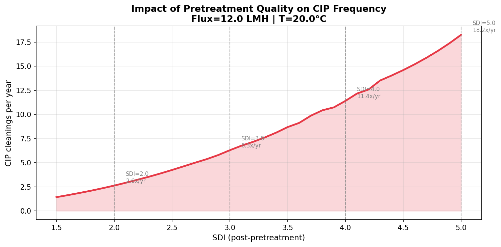
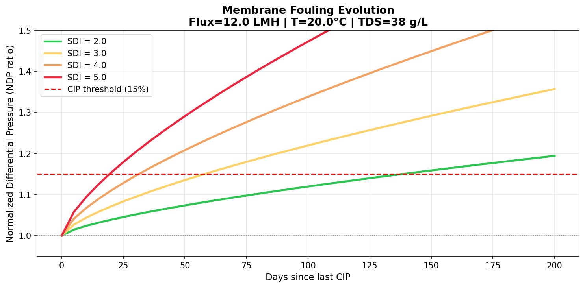
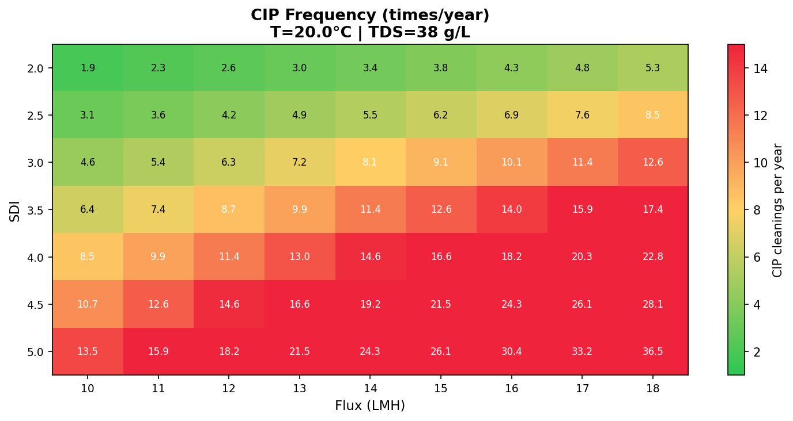
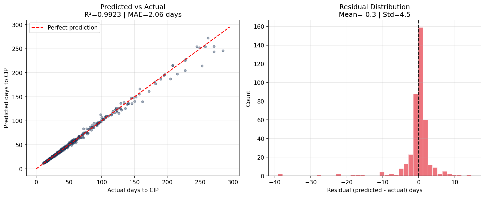

# RO Fouling Optimizer

A physics-based ML tool for optimizing CIP cleaning frequency 
in reverse osmosis plants during the EPC design phase.

## Live Demo
👉 Coming soon

---

## The Problem

In EPC design, CIP cleaning frequency is typically set as a static 
criterion (e.g. 3 times/year) based on manufacturer recommendations 
or engineering experience, without considering the actual seasonal 
variability of the feed water at the specific site.

An oversized cleaning frequency increases OPEX unnecessarily. 
An undersized frequency accelerates membrane degradation and 
increases replacement costs.

---

## Key Finding

**Pretreatment quality (SDI) is the dominant factor in CIP frequency, 
accounting for 83% of variance in the ML model.**

Reducing SDI from 4.0 to 3.0 at the pretreatment design stage cuts 
CIP frequency from ~11 to ~6 times/year — nearly half the cleaning 
operations, with direct impact on chemical costs, service water 
consumption, train downtime, and membrane lifetime.



---

## How It Works

1. **Physics model**: Power-law cake filtration model simulates 
   membrane fouling evolution (NDP ratio) over time
2. **Synthetic dataset**: 2000 scenarios generated across realistic 
   SWRO operating ranges
3. **ML model**: Random Forest Regressor (R²=0.992, MAE=2 days) 
   predicts days to CIP threshold
4. **Design tool**: Heatmap of CIP frequency across flux/SDI design space

---

## Results

### Membrane Fouling Evolution by SDI


### CIP Frequency Design Map (Flux vs SDI)


### ML Model Evaluation


---

## Scope and Limitations

- Physics model based on power-law cake filtration (n=0.7)
- Validated against published SWRO operating ranges
- Synthetic data only — model should be retrained with real plant 
  data when available
- SDI used as proxy for colloidal fouling potential
- Does not model biological fouling or scaling separately

---

## Project Structure
ro-fouling-optimizer/
│
├── core/
│   ├── fouling_model.py      # Physics: NDP ratio, days to CIP
│   ├── data_generator.py     # Synthetic dataset generation
│   ├── fouling_predictor.py  # Random Forest ML model
│   └── visualizations.py    # Plots and design maps
│
├── outputs/                  # Generated figures
├── notebooks/                # Validation case (coming soon)
└── test_fouling.py           # Validation script

## Scientific References

- Field, R.W. et al. (1995). Critical flux concept for microfiltration 
  fouling. *Journal of Membrane Science*, 100(3), 259-272.
- Darcy, H. (1856). Les fontaines publiques de la ville de Dijon.
- ASTM D4194 - Standard Operating Procedures for RO membrane elements.

---

## Requirements

```bash
pip install numpy scipy matplotlib pandas scikit-learn jupyter
```

---

## Author

Álvaro Menéndez — Process Engineer, Water Sector  
[LinkedIn](https://www.linkedin.com/in/alvaro-mendoza-bonilla)  
[GitHub](https://github.com/alvmenbon)